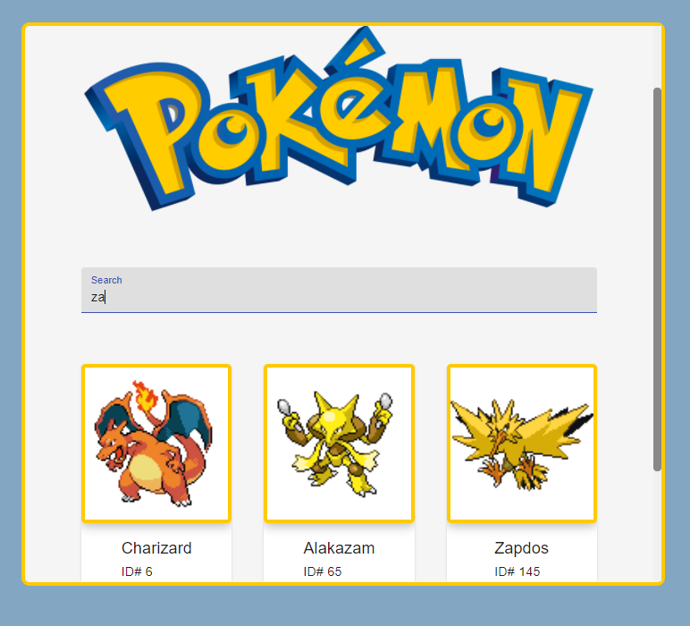

# react-pokedex-assignment
Samaritan's coding assignment - Create an app that simulates a mini pokedex using [The open Pokemon API](https://pokeapi.co/).

# Screenshots
## Main Page

## Search Functionality

## Pokemon Details

### Moves & Abilities

